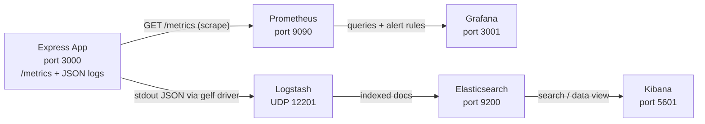
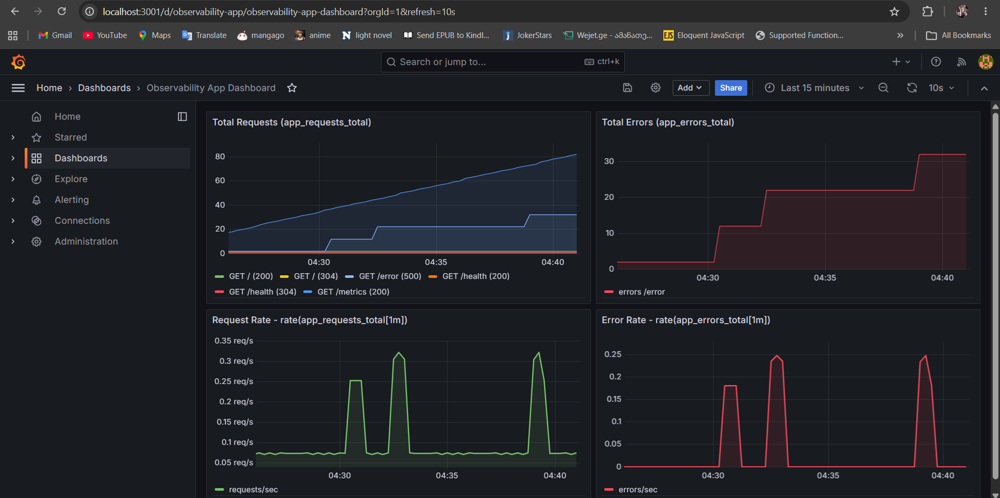
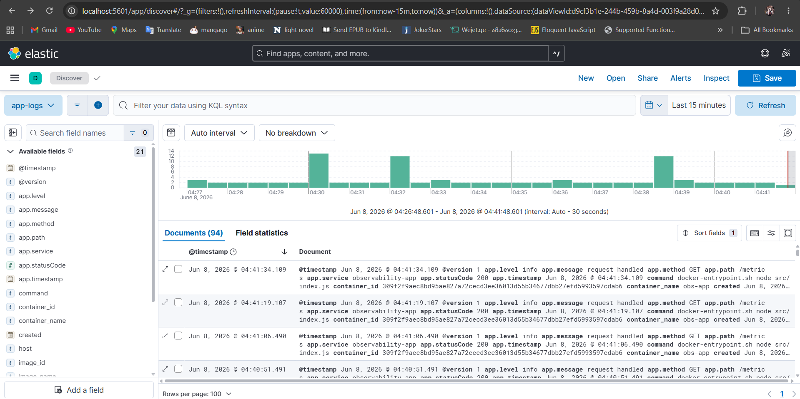
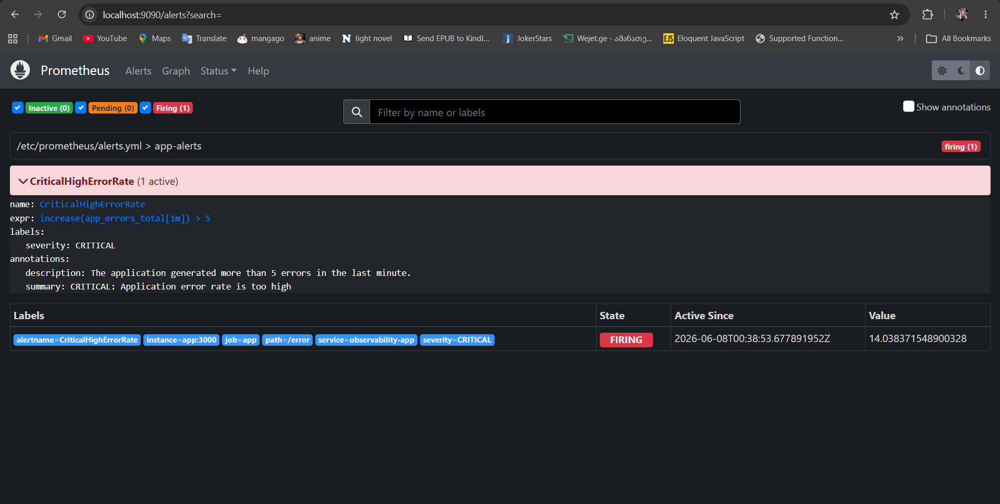

# DevOps Observability Lab
## Overview

A small instrumented **Node.js / Express** application exposes Prometheus metrics
and emits structured **JSON logs** to stdout. Around it we run a full
observability platform:

- **Prometheus** scrapes the app's `/metrics` endpoint and evaluates alert rules.
- **Grafana** visualizes the metrics on a dashboard and surfaces the alert state.
- **ELK (Elasticsearch + Logstash + Kibana)** collects, parses, stores, and lets
  you search the application's JSON logs.

A Prometheus alert (`CriticalHighErrorRate`) fires at **CRITICAL** severity when
the application produces **more than 5 errors in one minute**.

---

## Architecture Diagram



Plain-text summary:

```
Application            --> Prometheus --> Grafana
Application JSON logs  --> Logstash   --> Elasticsearch --> Kibana
```

---

## Technology Stack

| Layer                | Technology            | Image / Library                                   | Port (host) |
| -------------------- | --------------------- | ------------------------------------------------- | ----------- |
| Application          | Node.js + Express     | `node:20-alpine`, `express`, `pino`, `prom-client`| `3000`      |
| Metrics              | Prometheus            | `prom/prometheus:v2.54.1`                          | `9090`      |
| Dashboards / Alerts  | Grafana               | `grafana/grafana:11.2.0`                           | `3001`      |
| Log storage / search | Elasticsearch         | `elasticsearch:8.15.1`                             | `9200`      |
| Log ingestion        | Logstash              | `logstash:8.15.1`                                  | `12201/udp` |
| Log exploration      | Kibana                | `kibana:8.15.1`                                    | `5601`      |

---

## How to Run

Requirements: **Docker** and **Docker Compose** (Docker Desktop on Windows/macOS).

```bash
docker compose up --build -d
```

Give the stack ~1–2 minutes to become healthy (Elasticsearch and Kibana take the
longest). Then open:

| Service       | URL                                            | Credentials     |
| ------------- | ---------------------------------------------- | --------------- |
| Application   | http://localhost:3000                          | –               |
| Prometheus    | http://localhost:9090                          | –               |
| Grafana       | http://localhost:3001                          | `admin` / `admin` |
| Kibana        | http://localhost:5601                          | –               |
| Elasticsearch | http://localhost:9200                          | –               |

Check everything is up:

```bash
docker compose ps
```

---

## Application Endpoints

| Method | Endpoint   | Description                                                        |
| ------ | ---------- | ----------------------------------------------------------------- |
| GET    | `/`        | Friendly hello message (JSON).                                    |
| GET    | `/health`  | Health check, returns `{ "status": "ok" }`.                      |
| GET    | `/error`   | Returns HTTP 500 and increments `app_errors_total` (alert demo).  |
| GET    | `/metrics` | Prometheus exposition format for scraping.                        |

Quick test:

```bash
curl http://localhost:3000/
curl http://localhost:3000/health
curl http://localhost:3000/metrics
curl http://localhost:3000/error
```

PowerShell equivalent:

```powershell
curl.exe http://localhost:3000/
curl.exe http://localhost:3000/metrics
curl.exe http://localhost:3000/error
```

---

## Metrics

The app exposes default Node.js runtime metrics plus two **custom counters** via
`prom-client`:

| Metric               | Type    | Labels                        | Meaning                                |
| -------------------- | ------- | ----------------------------- | -------------------------------------- |
| `app_requests_total` | Counter | `method`, `path`, `status_code` | Incremented on **every** HTTP request. |
| `app_errors_total`   | Counter | `path`                        | Incremented on `/error` and on any unhandled error. |

Useful queries (PromQL):

```promql
app_requests_total
app_errors_total
sum(rate(app_requests_total[1m]))   # request rate (req/s)
sum(rate(app_errors_total[1m]))     # error rate
increase(app_errors_total[1m])      # errors in the last minute (drives the alert)
```

The provisioned Grafana dashboard **"Observability App Dashboard"** contains four
panels: total requests, total errors, request rate, and error rate.

---

## Logging Strategy

- The application logs **one JSON object per line** to stdout using **pino**.
- Each line contains the fields: `timestamp`, `level`, `service`, `method`,
  `path`, `statusCode`, `message`.
- Docker's **`gelf` logging driver** ships each stdout line to **Logstash** (UDP
  `12201`).
- The Logstash pipeline applies a **`json` filter** so the fields are parsed into
  structured, searchable fields (under `app.*`) rather than stored as one raw
  text blob, then writes documents to **Elasticsearch** in daily indices
  `app-logs-YYYY.MM.dd`.
- **Kibana** queries Elasticsearch so the structured logs are searchable.


### Viewing logs in Kibana

1. Open http://localhost:5601.
2. Go to **Stack Management → Data Views → Create data view**.
3. Name: `app-logs`, Index pattern: `app-logs-*`, Timestamp field: `@timestamp`.
4. Open **Discover** and search, e.g. `app.statusCode: 500` or `app.path: "/error"`.

---

## Alerting

Prometheus loads alert rules from [`prometheus/alerts.yml`](prometheus/alerts.yml):

```yaml
groups:
  - name: app-alerts
    rules:
      - alert: CriticalHighErrorRate
        expr: increase(app_errors_total[1m]) > 5
        for: 0m
        labels:
          severity: CRITICAL
        annotations:
          summary: "CRITICAL: Application error rate is too high"
          description: "The application generated more than 5 errors in the last minute."
```

- **Where to see it firing:**
  - Prometheus → **Alerts** tab (http://localhost:9090/alerts) — the rule moves
    from green (`Inactive`) to red (`Firing`).
  - Grafana → **Alerting → Alert rules** — the Prometheus-managed rule is shown
    (read-only) via the provisioned datasource.

---

## How to Trigger the CRITICAL Alert

Call `/error` more than 5 times within one minute.

**Bash / Linux / macOS:**

```bash
for i in {1..10}; do curl http://localhost:3000/error; done
```

**Windows PowerShell:**

```powershell
1..10 | ForEach-Object { curl.exe http://localhost:3000/error }
```

Within ~15–30 seconds, `increase(app_errors_total[1m])` exceeds 5 and the
`CriticalHighErrorRate` alert transitions to **Firing** in Prometheus (and is
visible in Grafana).

---

## Evidence Screenshots

**Grafana dashboard (metrics):**



**Kibana parsed JSON logs:**



**Grafana / Prometheus alert firing:**



---

## Analysis

### Why is JSON-structured logging more efficient than plain text logs?

In this project, the Express application uses **pino** to write one JSON object
per log line to stdout. Each request log already has named fields such as
`timestamp`, `level`, `service`, `method`, `path`, `statusCode`, and `message`.
Docker sends those lines to Logstash using the **gelf** logging driver, and the
Logstash pipeline applies a **json filter** to parse the log body into `app.*`
fields before storing it in Elasticsearch.

That is more efficient than plain text because Logstash does not need fragile
regex/grok parsing to guess where the status code, path, or log level is. The
fields are already structured, so Elasticsearch can index them directly and
Kibana can query them directly, for example `app.statusCode: 500` or
`app.path: "/error"`. Plain text logs are mostly useful as human-readable
strings; JSON logs are useful both for humans and for automated searching,
filtering, alert investigation, and dashboarding.

### What is the fundamental technical difference between Prometheus and ELK?

**Prometheus** is the metrics system in this setup. It scrapes the application's
`/metrics` endpoint and stores numeric time-series samples, such as
`app_requests_total{method, path, status_code}` and `app_errors_total{path}`.
Those samples are designed for PromQL calculations like request rate, error
rate, and `increase(app_errors_total[1m])`, which is what drives the
`CriticalHighErrorRate` alert.

**ELK** is the logging system in this setup. The app writes JSON log events,
Docker forwards them to Logstash over UDP `12201`, Logstash parses them, and
Elasticsearch stores them as searchable documents in daily `app-logs-YYYY.MM.dd`
indices. Kibana is then used to inspect the individual events.

The key difference is the data model: Prometheus stores numeric measurements
over time, while ELK stores event documents. Prometheus answers questions like
"how many errors happened per minute?", while ELK answers questions like "which
request returned HTTP 500, on which path, and what did the log message say?"

### How would you handle long-term log retention without depleting disk resources?

Because this project already writes logs into daily Elasticsearch indices named
`app-logs-YYYY.MM.dd`, I would manage six-month retention with an Elasticsearch
Index Lifecycle Management (ILM) policy.

For example, I would keep recent logs in a hot phase for fast Kibana searches,
then move older indices to cheaper storage, reduce replicas, and apply stronger
compression. After six months, the policy would either delete the old
`app-logs-*` indices automatically or snapshot them first to low-cost object
storage such as S3, GCS, or Azure Blob before deletion.

This keeps the local `elasticsearch-data` Docker volume from growing forever
while still preserving a recovery path if older logs are needed later.

---

## Cleanup

Stop the stack (keep data volumes):

```bash
docker compose down
```

Stop **and** remove volumes (Grafana + Elasticsearch data) and built images:

```bash
docker compose down -v --rmi local
```

---

## Repository Structure

```
.
├── app/
│   ├── Dockerfile
│   ├── package.json
│   └── src/
│       └── index.js
├── prometheus/
│   ├── prometheus.yml
│   └── alerts.yml
├── grafana/
│   └── provisioning/
│       ├── datasources/
│       │   └── datasource.yml
│       └── dashboards/
│           ├── dashboard.yml
│           └── app-dashboard.json
├── logstash/
│   └── pipeline/
│       └── logstash.conf
├── docs/
│   └── screenshots/
├── docker-compose.yml
└── README.md
```
